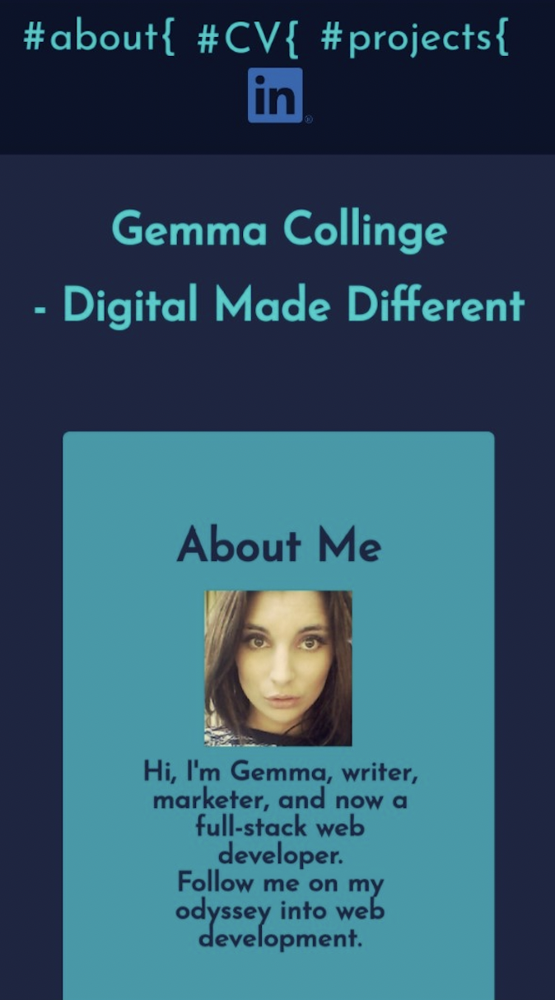
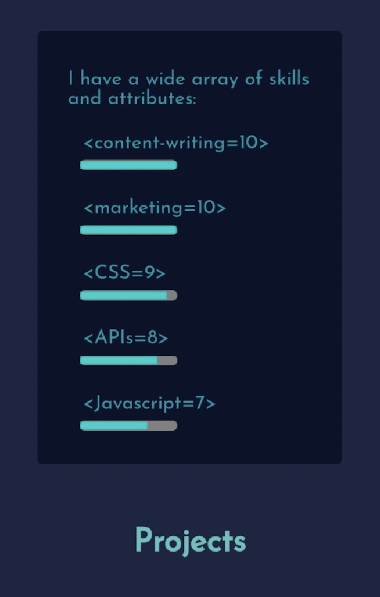
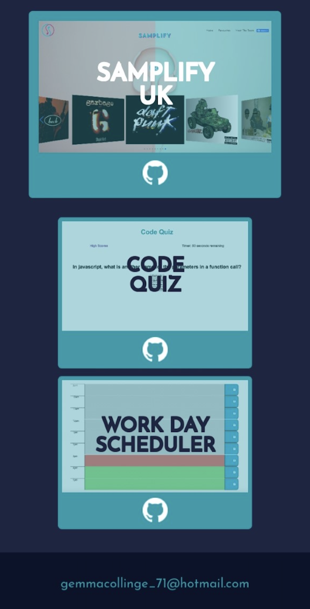
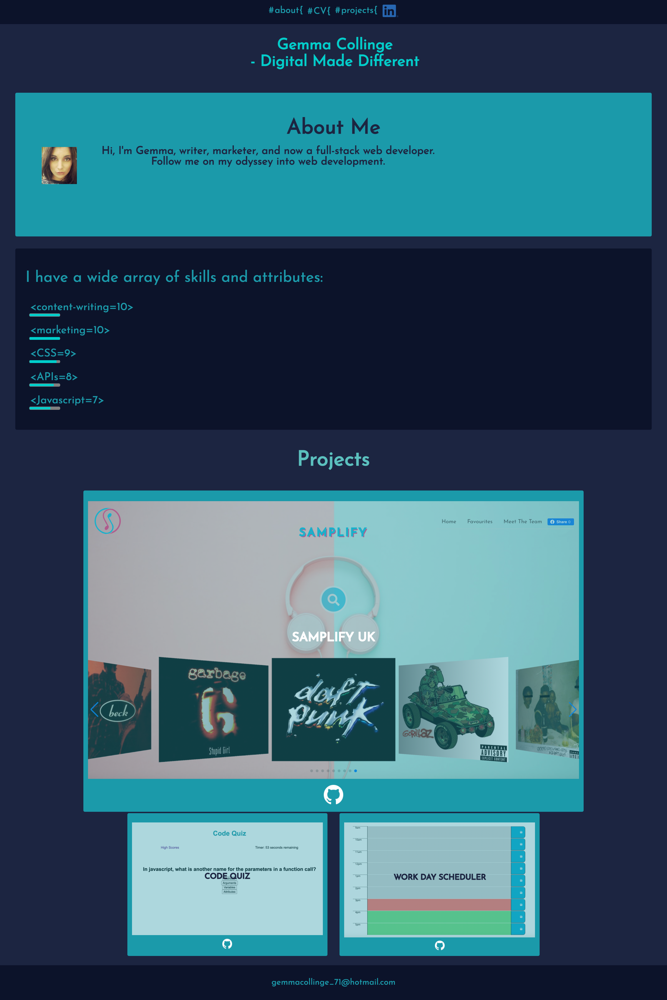

# Gemma Collinge's Portfolio

## Link to deployed application

Click [here](https://gemmac-coder.github.io/Gemma-Collinge-Portfolio/) to view the project on Github pages.

## Description

I was tasked to create a portfolio to attract potential employers by showcasing my development work and allowing potential employers to learn a little more about me and my skills. My portfolio had to provide an image of me, links to my work and a contact link.

## Technologies & Languages Used:

- HTML5
- CSS

## License

MIT

## What did I do?

- Used semantic HTML
- Used CSS selectors to create a sleek, streamlined layout
- Used CSS variables for the different thematic colours in my page
- Created a navigation bar to allow employers to quickly navigate through the sections or to click through to my LinkedIn or CV to view my work history in depth
- Used hover selectors to add interactivity to links and sub-headings
- Used pseudo-elements to style my navigation links as css element selectors, to reflect my understanding of css and add a meta feel to my page
- Styled my personal attributes as coded html attributes to play on the notion of linguistic and html attributes, in order to reflect my multi-faceted content writing and web development expertise
- Used progress bars to visually reinforce my varying levels of skills and attributes
- Used flexbox and media queries to create a responsive layout, to enhance readability and to maximise available screen space at different viewports
- Used absolute and relative positioning to overlay my project card titles on the project card images
- Made images accessible by adding alt attributes
- Formatted code using lint (prettier)
- Added explanatory comments to both the HTML and CSS files

## Screenshots

For more information and for all queries, please contact: gemmacollinge_71@hotmail.com
